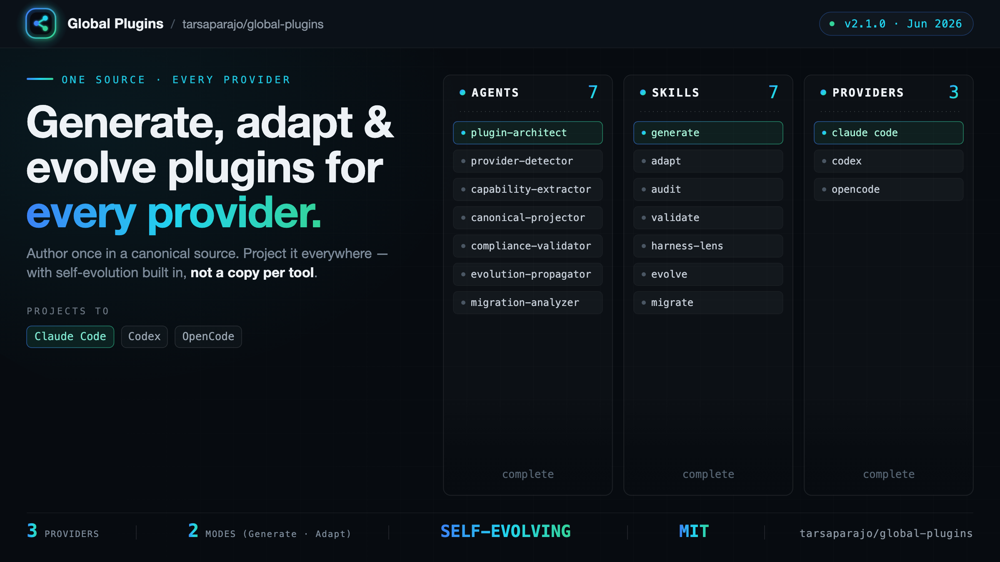

<div align="center">

**Language:** [English](../../README.md) | [Português (Brasil)](../pt-BR/README.md) | 简体中文 | [繁體中文](../zh-TW/README.md) | [日本語](../ja-JP/README.md) | [한국어](../ko-KR/README.md) | [Türkçe](../tr/README.md) | [Русский](../ru/README.md) | [Tiếng Việt](../vi-VN/README.md) | [ไทย](../th/README.md) | [Deutsch](../de-DE/README.md) | [Español](../es/README.md) | [Français](../fr/README.md) | [Italiano](../it/README.md)

# Global Plugins



单一规范源，覆盖所有服务商。只需一句描述，即可生成、适配并演进 AI 编程插件。

[](../../LICENSE)
[](../../VERSION)
[](https://buymeacoffee.com/tarsaparajo)

**Language / 语言 / 語言 / Dil / Язык / Ngôn ngữ / Idioma / Idioma / Langue / Lingua**

[English](../../README.md) | [Português (Brasil)](../pt-BR/README.md) | 简体中文 | [繁體中文](../zh-TW/README.md) | [日本語](../ja-JP/README.md) | [한국어](../ko-KR/README.md) | [Türkçe](../tr/README.md) | [Русский](../ru/README.md) | [Tiếng Việt](../vi-VN/README.md) | [ไทย](../th/README.md) | [Deutsch](../de-DE/README.md) | [Español](../es/README.md) | [Français](../fr/README.md) | [Italiano](../it/README.md)

</div>

---

## 概述

**Global Plugins** 用于构建和维护跨多家服务商的 AI 编程插件。你只需在一份与服务商无关的**规范源（canonical source）**中编写一次插件；一个确定性引擎会将其**投影（project）**为每个受支持服务商的原生格式。这些投影产物会被纳入版本管理——绝不手工编辑，始终从规范源重新生成。最终效果是：单一事实来源，多家服务商，完美同步。

无论是谁，只要想让一个插件在任何地方都能用、而不必为每个工具维护一份独立副本，它都能派上用场——用通俗的语言描述即可，无需深厚的技术功底。

## 能力

### GENERATE（生成）

用自然语言描述一个插件，Global Plugins 便会设计出它的完整架构——技能、智能体、钩子、命令、权限——并将其投影到每一个选定的服务商，且内建自我演进能力。

### ADAPT（适配）

指向一个为单一服务商构建的插件，Global Plugins 会将其提升为规范形态，并投影到所有服务商，100% 保留其原有功能。

### EVOLVE（演进）

它生成的每个插件都自带专属的演进引擎：只需修改一次规范源，改动便会镜像到每一个服务商——并附带一致性校验、版本号递增、变更日志与账本条目，以及面向已安装副本的条件式迁移。任何写入之前，仅需一次确认。

## 服务商矩阵

| 服务商 | 范围 | 仓库目录 | 安装到 | 关键转换 | 需构建 |
|----------|-------|-------------|-------------|-------------------|-------|
| claude | home | `.claude` | marketplace / `~/.claude` | 复制；MCP 合并 | — |
| codex | home | `.codex` | `~/.codex` | 智能体转 TOML；`AGENTS.md` 索引 + 同级的 skills/commands 文件 + `config.toml` | — |
| opencode | home | `.opencode` | `~/.config/opencode` | 复制；编译后的插件置于 `dist/` 下 | 是 |

**范围：** 三家全部为 *home* 类服务商（命令行工具）——每一家都保留一份全局的、按用户区分的配置。**仓库目录**是本仓库中的点目录名（投影源）；**安装到**是你为让该服务商读取而放置它的位置。

注册表是开放的。要新增服务商，只需在注册表中扩展一个真实条目、一份服务商契约、一个适配器模块以及一个测试。

## 安装

每个服务商已纳入版本管理的点目录（dotfolder）都是真实、开箱即用的产物，由重新投影自动生成——切勿手工编辑。请在下方选择你的服务商。

### Claude Code

Claude Code 通过插件 marketplace 安装——无需克隆：

```
/plugin marketplace add tarsaparajo/global-plugins
/plugin install tarsaparajo@global-plugins
```

`/plugin` 命令仅适用于 Claude Code。

### Codex

Codex 没有针对本插件的 marketplace 安装方式，因此请克隆仓库，并将其 `.codex` 目录复制到 Codex 的全局配置目录：

```
git clone https://github.com/tarsaparajo/global-plugins
cd global-plugins
mkdir -p ~/.codex
cp -R .codex/. ~/.codex/
```

Codex 读取 `~/.codex/`：当你下次运行 `codex` 时，它会自动检测 `~/.codex/config.toml`、`AGENTS.md` 索引、`[agents.<name>]` 角色以及同级的 `skills/`/`commands/` 文件。

### opencode

opencode 没有针对本插件的 marketplace 安装方式，因此请克隆仓库，构建编译后的插件，然后将其 `.opencode` 目录复制到 opencode 的全局配置目录：

```
git clone https://github.com/tarsaparajo/global-plugins
cd global-plugins
node engine/build-opencode.js          # build the compiled plugin (produces .opencode/dist/)
mkdir -p ~/.config/opencode
cp -R .opencode/. ~/.config/opencode/
```

opencode 从 `~/.config/opencode/`（而非 `~/.opencode/`）读取其全局配置。使用前必须先执行构建步骤；它会生成 `.opencode/dist/`。

请参阅[服务商矩阵](#provider-matrix)，了解每个服务商应用的具体转换。

## 用法

| 命令 | 作用 |
|---------|--------------|
| `/global-plugins:generate <briefing>` | 根据描述生成一个跨多家服务商的插件。 |
| `/global-plugins:adapt <path>` | 将单一服务商的插件适配到所有服务商。 |
| `/global-plugins:audit <path>` | 对插件进行深入、只读的审计。 |
| `/global-plugins:validate <path>` | 快速的通过/不通过校验关卡。 |
| `/global-plugins:harness-lens <idea>` | 探索某个插件构想会如何被组合而成。 |
| `/global-plugins:evolve <change>` | 将一处规范源改动镜像到每一个服务商，并附带一致性校验、版本号递增、变更日志与条件式迁移。 |
| `/global-plugins:migrate [--dry-run \| --apply \| --rollback]` | 对已安装的副本应用待处理的迁移链。 |

Global Plugins 是自托管的：它自身就附带 evolve 与 migrate 能力，并将同样的 `/<plugin>:evolve` 与 `/<plugin>:migrate` 镜像到它生成的每一个插件中。

**可从任意提供方生成 — 不仅限于 Claude Code。** 投影引擎以 runtime payload 的形式随每次安装一同携带，因此已安装的插件本身就能从三种 CLI 创建/适配/演进多提供方的子插件。Claude Code 通过整仓安装携带它；**Codex** 与 **opencode** 则将其放在保留的子目录 `engine/`（`~/.codex/engine/`、`~/.config/opencode/engine/`）中携带。在 Codex 上，代理使用 Node 运行打包好的引擎（`cd ~/.codex/engine && node scripts/evolve/project.mjs`，每次运行需一次批准）；在 opencode 上，`dist/` 中编译后的插件会暴露由同一 payload 支撑的原生工具 `generate`/`adapt`/`evolve`/`validate`/`migrate`。每个生成的子插件也都携带引擎，因此它自给自足，可独立地重新投影。

## 内部架构

规范源 → **解析器（resolver）**（服务商注册表 + 三层清单：profiles → modules → components）→ 各服务商的**投影（projection）**模块 → 投影**执行器（executor）**。一套组合式的设计视角，会从一段自然语言请求出发塑造插件的运行框架（harness）。治理机制（SemVer 同步、变更日志、一致性、提示词防御、合规）已内建于引擎之中。

## 许可证

MIT — Tarsa · [buymeacoffee.com/tarsaparajo](https://buymeacoffee.com/tarsaparajo)
